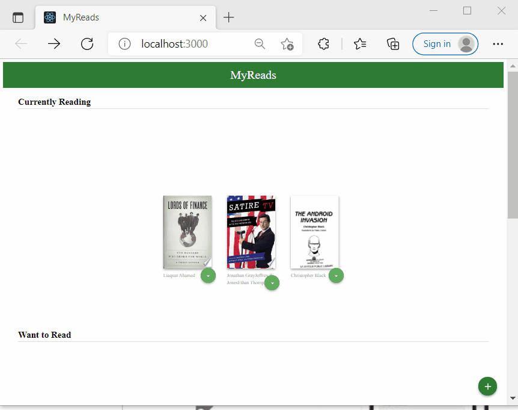

# My Reads

I created this website as a project for my React Nanodegree from Udacity. This website allows the user to select and categorize books he/she has read, is currently reading, or want to read. 

## Prerequisite

* Git
* npm

## Installation and Launch

1. To install the application clone this git repository

2. Go into the application folder

3. Install dependencies using `npm install` command line tool

4. Run the application, again using `npm start`

**This will open a new browser tab/window with the application running.**

## Built with

* React - Text Editor
* Create React App - React scaffolding package
* React Router - Declarative routing for React
* Atom - Text Editor
* JavaScript ES6 - Programming Language
* HTML5 - Markup Language
* CSS3 - Styling
* Google Chrome - Browser and Debugging Tool

## Backend Server
To simplify our development process, we've provided with a backend server. The provided file `BooksAPI.js` contains the methods you will need to perform necessary operations on the backend:

* getAll
* update
* search

## Create React App
This project was bootstrapped with `Create React App`. You can find more information on how to perform common tasks [here](https://github.com/facebookincubator/create-react-app/blob/master/packages/react-scripts/template/README.md).

